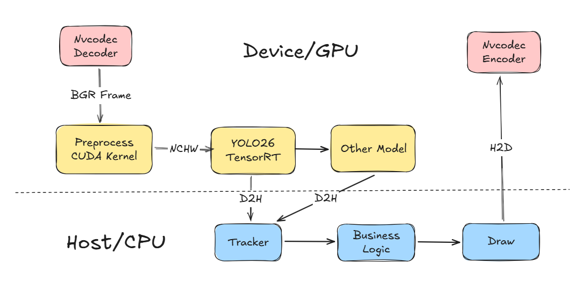

<p style="" align="center">
  
</p>
<h1 align="center">VidProc</h1>
<p style="margin:0px" align="center">
    
    
    
</p>

---

VidProc 是一个基于 Python 的高性能多路视频处理流水线框架

⭐ 多进程单线程绕过 GIL 限制，支持多视频流、多 GPU 与多模型推理

⭐ 减少 Host-Device 数据传输，降低 GPU 显存冗余拷贝，提升推理速度

⭐ 尽可能在 GPU 上计算，以降低 CPU 计算负担

⭐ 开箱即用，简单易懂，扩展性强，适合中小型项目快速部署

|                                                           | Open Source |          Learning Curve          |      Developer Friendliness      | Performance |      Architecture Design       |
| :-------------------------------------------------------: | :---------: | :------------------------------: | :------------------------------: | :---------: | :----------------------------: |
| [DeepStream](https://developer.nvidia.com/deepstream-sdk) |      ❌      |               High               |               Low                |    High     | Single-process, multi-threaded |
| [VideoPipe](https://github.com/sherlockchou86/VideoPipe)  |      ✅      | medium（requires cpp knowledge） | Medium（requires cpp knowledge） |   Medium    | Single-process, multi-threaded |
|                            Our                            |      ✅      |               ≈ 0                |         High +++++++++++         |   Medium    | Multi-process, single-threaded |

## Quick Start

本项目推荐 Docker 容器运行，首先确保本地环境满足以下三个条件：

- Docker >= 24.0.0
- NVIDIA Driver >= 590
- NVIDIA Container Toolkit >= 1.13.0

### 1. 生成镜像

clone 本项目，生成包含完整开发环境的镜像

```bash
git clone https://github.com/lmk123568/vidproc.git
cd VidProc/docker
docker build -t vidproc:cuda12.8 .
```

镜像生成后，进入容器，不报错即成功

```bash
docker run -it \
  --gpus all \
  -e NVIDIA_DRIVER_CAPABILITIES=all \
  -v {your_path}/VidProc:/workspace \
  PyNvVideoPipe:cuda12.6 \
  bash
```

后续示例代码默认在容器内`/workspace`运行

> ⚠️ 不推荐自己本地装环境，如果一定要自己装，请参考 Dockerfile

### 2. 编译加速包

```bash
python scripts/setup.py install
```

### 3. 训练模型权重转换

将通过 [ultralytics](https://github.com/ultralytics/ultralytics) 训练的`pt`模型导入到当前目录下（示例模型为 [yolo26n.pt](https://github.com/ultralytics/assets/releases/download/v8.4.0/yolo26n.pt)）

```bash
python scripts/pt2trt.py  --w ./yolo26n.pt --fp16
```

> 💡 推理尺寸建议`(576,1024)`，可以跳过`letterbox`降低计算开销

### 4. 运行

开启 MPS（Multi-Process Service）

```bash
nvidia-cuda-mps-control -d
# echo quit | nvidia-cuda-mps-control  关闭 MPS
```

阅读理解其代码并运行

```bash
python main.py
```

## Benchmark

测试日期: 2026-01-25

测试硬件: AMD Ryzen 9 5950 X + NVIDIA GeForce RTX 3090

测试任务: 4 × RTSP Decoders → YOLO26 (TensorRT) → 4 × RTMP Encoders

|                           | CPU     | RAM     | GPU VRAM | **GPU-Util** |
| ------------------------- | ------- | ------- | -------- | ------------ |
| VideoPipe（ffmpeg codec） | 511.6 % | 1.5 GiB | 2677 MiB | 16 %         |
| Our                       | 40 %    | 1.2GiB  | 3932 MiB | 12 %         |

> 工程不是追求完美的数学解，而是在资源受限、时间紧迫、需求模糊的情况下，寻找一个可用的最优解

## Pipeline



## License

[BSD-2-Clause](https://github.com/lmk123568/PyNvVideoPipe/blob/main/LICENSE)
